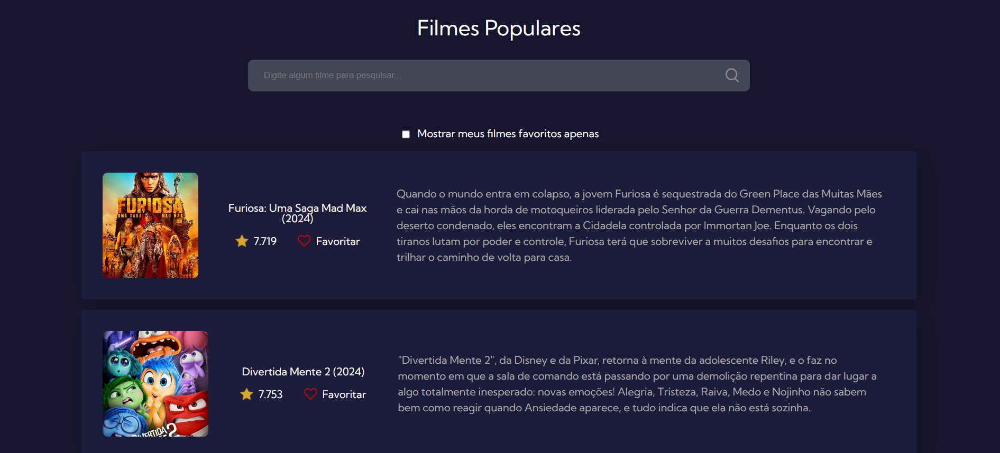

## Filmes Populares
Esse projeto foi desenvolvido na 7 days of code da Alura para praticar meus conhecimentos em HTML, CSS e JavaScript.

## Funcionalidades
- Consome a API da The Movie DataBase.  
- Exibe a imagem, o nome, o ano de lançamento, a nota e a sinopse.  
- Busca os filmes pelo nome.  
- Opção de favoritar os filmes.  
- Botão de exibir apenas os favoritos.  
- Resposividade para mobile.

## Tecnologias utilizadas
- HTML
- CSS
- JavaScript
- API The Movie DataBase
